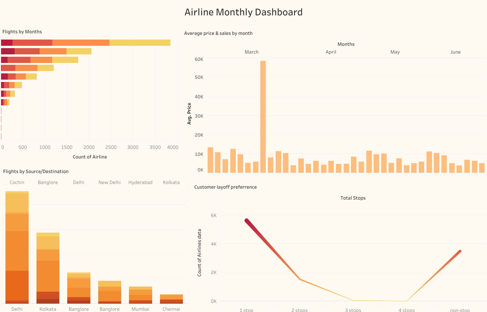
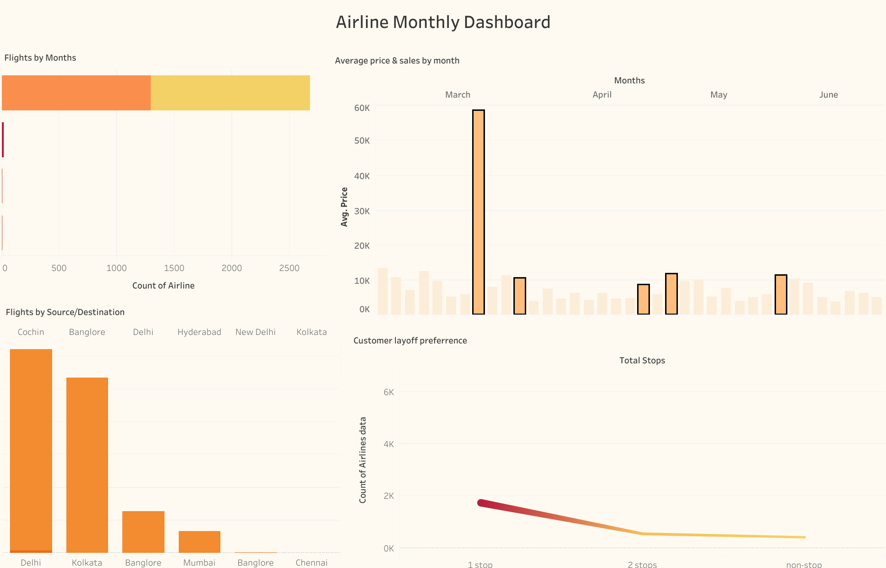
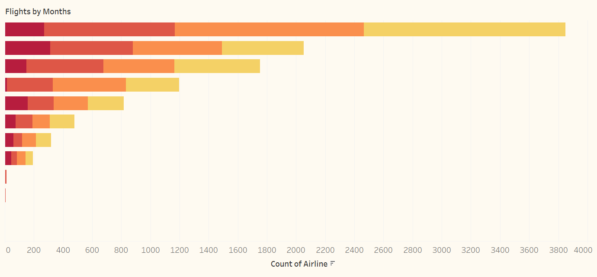
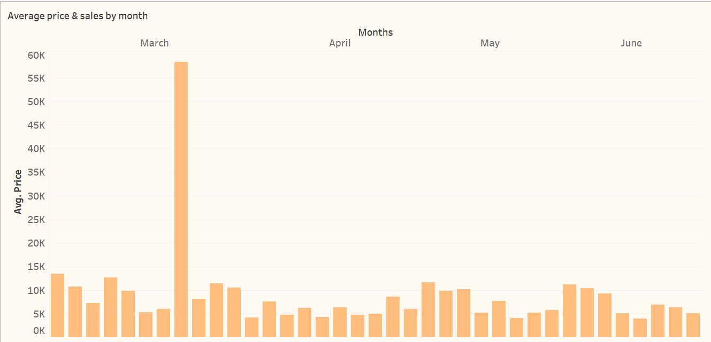
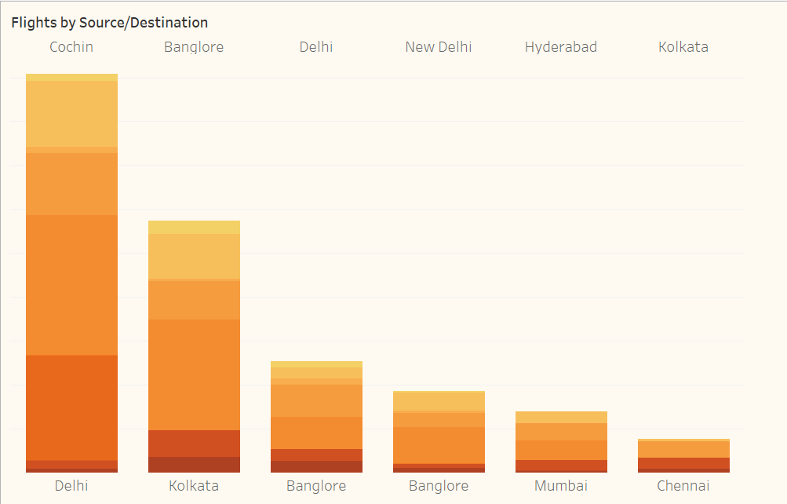
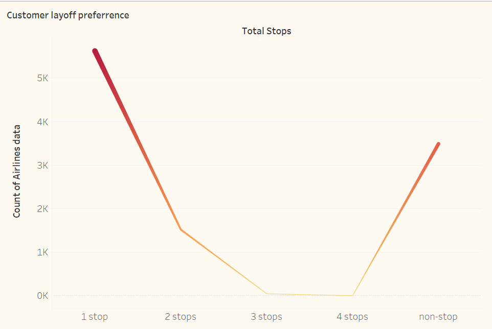

<h1 align="center">Airline Data Analysis Project</h1>

## Description

This project involves a comprehensive analysis of airline data, including attributes such as airfare, departure, destination, source, date, time, and various other factors. The primary objective is to derive meaningful insights and trends from the dataset to inform decisions and strategies in the airline industry.

## Dashboard

The airline data dashboard offers a comprehensive overview of essential metrics and trends. The following screenshots illustrate the dashboard's functionality. Key features include:

- **Dynamic Interactivity**: All graphs and components are fully interactive, ensuring a seamless user experience.
- **Accurate Responses**: The dashboard accurately responds to specific queries, providing precise data insights.
- **Comprehensive Metrics**: It covers all necessary metrics, presenting them in a clear and concise manner.

  
  

## Visualization

The visualization section includes various charts and graphs that illustrate significant patterns and insights from the airline data. Below are some examples:

  
  

  
  

## Tools Utilized

The following tools were utilized in this project:
- **Excel**: Utilized for data cleaning, formatting, and removal of duplicate values and strings.
- **Tableau**: Employed for data visualization to derive insightful and actionable intelligence.

## Author

This project was solely developed by [DexterCosmos]. If you have any questions or require further information, please feel free to reach out.